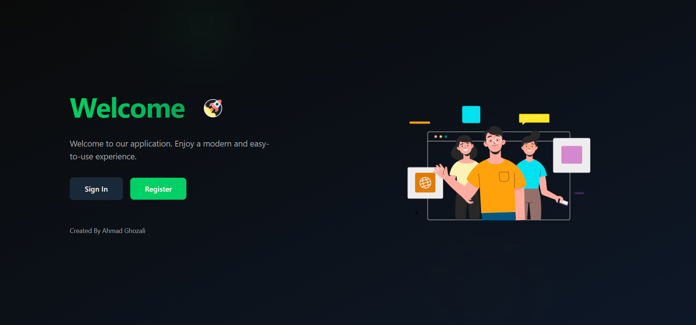
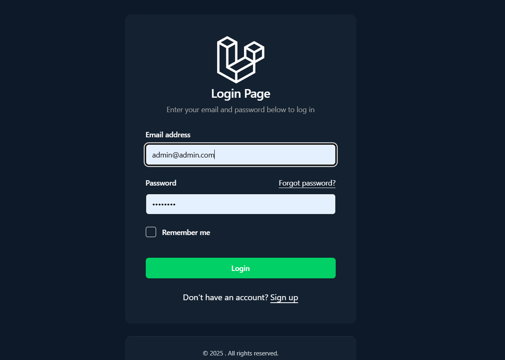
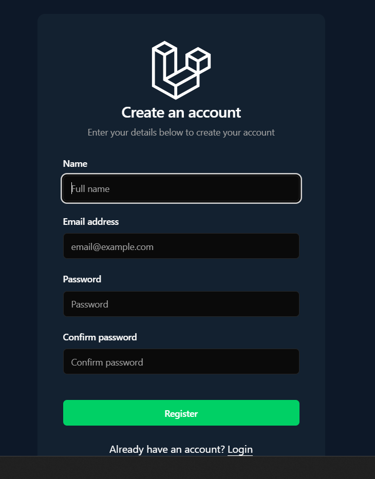
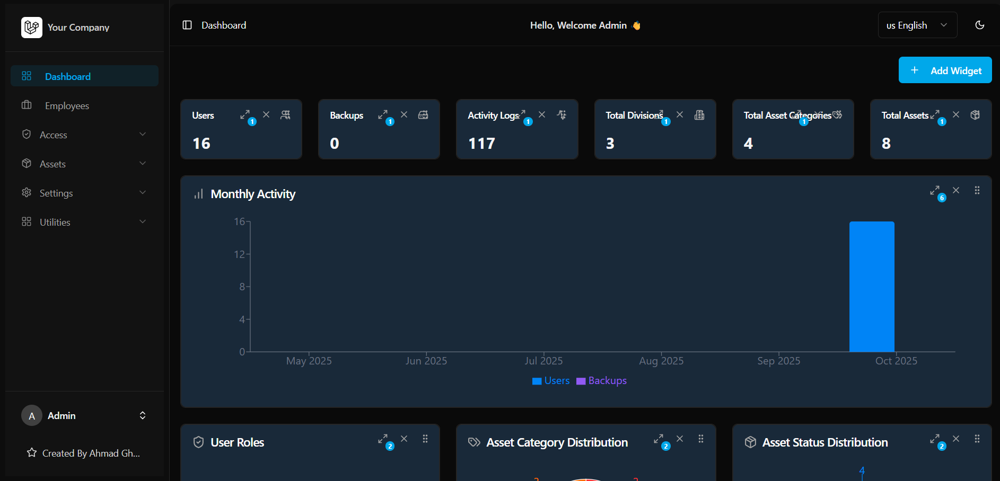

# 🚀 Laravel 12 + React Starter Kit

A modern and flexible starter kit built with **Laravel 12**, **React (Inertia.js + TypeScript)**, **TailwindCSS**, and **ShadCN UI v4**. Designed to accelerate secure, responsive, and customizable dashboard application development.

---

## ✨ Features

- 🔐 Full authentication (login, register, reset password)
- 👥 Role & Permission Management (Spatie Laravel Permission)
- 📂 Dynamic Sidebar & Menus based on role & permission
- 🧩 Drag & drop menu management (nested, reorder)
- ⚙️ App settings (name, logo, theme color, SEO)
- 🎨 ShadCN UI v4 + TailwindCSS modern design
- 🌗 Dark/Light mode support
- 🔒 Dynamic access protection via `CheckMenuPermission` middleware
- ⚠️ Custom 403 Error Page (React-based)
- 💾 Primary color configuration via DB `--primary`
- 🪪 Audit Log to track user activity
- 📦 Manual & automatic database backup system
- 🗂️ File Manager with folder & file operations

### Assets Management (New)
- 🧾 Assets list with filters (Category, Employee, Location) — Employee/Asset filters use searchable Combobox
- 📝 Asset create/edit with dynamic custom fields per category
- 🧍 Assign asset to employee + track `last_used_at`
- 🏷️ Vendor and Location fields on Asset
- 🔄 Asset movements history (From → To: user/location)
- 🚚 Transfer asset (admin/it_support only) without approval, auto-log history
- 👁️ Asset detail page with tabs: Detail | History
- ⬇️ Import/Export (Excel/CSV/PDF)
- 🌐 i18n for UI labels (English/Indonesian)

---

## 🧱 Tech Stack

| Area        | Technology                         |
| ----------- | ---------------------------------- |
| Backend     | Laravel 12                         |
| Frontend    | React 19 + Inertia.js + TypeScript |
| UI Library  | ShadCN UI v4                       |
| CSS Utility | TailwindCSS                        |
| Auth        | Laravel Fortify / Breeze-style     |
| Access Ctrl | Spatie Laravel Permission v5       |
| DBMS        | MySQL / MariaDB                    |
| Layout      | Dynamic Sidebar + Header           |

---

## 🔧 Installation & Setup

```bash
# Create project
composer create-project ghozali25/Laravel-12-Starterkit my-app
cd my-app

# Backend setup
composer install

# Copy .env
cp .env.example .env

# Generate Key
php artisan key:generate

# Configure your database settings in .env
php artisan migrate:fresh --seed

# Frontend setup
npm install

# Running dev
composer run dev
```

Login using:

```
Email: admin@admin.com
Password: admin123
```

---

## 🚀 Deployment Guide

1. **Build Frontend for Production**

```bash
npm install
npm run build
```

2. **Run Laravel in Production Mode**

```bash
php artisan config:cache
php artisan route:cache
php artisan view:cache
```

3. **Set File Permissions**

```bash
chmod -R 775 storage bootstrap/cache
chown -R www-data:www-data .
```

4. **Serve with Web Server** (Nginx/Apache) pointing to `public/` folder.

---

## ✅ Manual Test Checklist

| Feature                  | Status |
| ------------------------ | ------ |
| Dashboard drag, resize   | ✅     |
| Dashboard add widget     | ✅     |
| Authentication (Login)   | ✅     |
| CRUD User                | ✅     |
| CRUD Role & Permission   | ✅     |
| Dynamic Menu + Sidebar   | ✅     |
| Division                 | ✅     |
| Role Manager & Leader    | ✅     |
| Access Protection (403)  | ✅     |
| Drag & Drop Menu Sorting | ✅     |
| Theme Color via DB       | ✅     |
| Dark Mode Support        | ✅     |
| Audit Logs Functionality | ✅     |
| Database Backup          | ✅     |
| File Manager             | ✅     |
| Assets (CRUD)            | ✅     |
| Asset Filters (Combobox) | ✅     |
| Asset Detail + History   | ✅     |
| Asset Transfer           | ✅     |
| Vendors & Locations      | ✅     |
| i18n Labels              | ✅     |

---

## 📦 Seeders Overview (Domain)

The seeding flow creates minimal, coherent domain data for Assets:

- LocationSeeder: creates a sample site (e.g., Karawaci)
- AssetCategorySeeder: only 3 categories — Laptop, Mobile Phone, Vehicle
- BrandSeeder: seeds brands and attaches them to categories
- VendorSeeder: seeds a few vendors
- AdditionalUserSeeder: seeds employees (non-admin) to assign assets
- AssetSeeder: creates assets per category and assigns optional employee, vendor, and current location
- AssetMovementSeeder: generates realistic movement history chain

Re-run full seed:

```
php artisan migrate:fresh --seed
```

---

## 🧭 Assets Usage Guide

### Filters (List Page)
- Use the search box + combobox filters for Employee and Location (contains, case-insensitive)

### Create / Edit Asset
- Pick Category → dynamic custom fields appear
- Optional: assign Employee, Vendor, and Location

### Detail & History
- Detail tab shows core info
- History tab shows movement logs (From/To user or location, status, reason)

### Transfer Asset (No Approval)
- On Asset Detail, click Transfer (admin/it_support only)
- Choose the target user and optional reason → submit
- System updates owner and logs an approved movement

---

## 🌐 Internationalization (i18n)

Translations are provided via Inertia shared props. Keys are stored in:

- `resources/lang/en.json`
- `resources/lang/id.json`

Contribute new keys by adding to the JSON files and referencing via `t('Your Key')` on the frontend.

---

# Screenshoot

<details>
  <summary><strong>Welcome Screen</strong></summary>

  
  
</details>

<details>
  <summary><strong>Login</strong></summary>

  
  
</details>

<details>
  <summary><strong>Register</strong></summary>

  
  
</details>

<details>
  <summary><strong>Dashboard</strong></summary>

  
  
</details>

## 📄 License

Released under the [MIT License](https://opensource.org/licenses/MIT). Feel free to use it for personal or commercial projects.

---

Created with ❤️ by [@ghozali25](https://github.com/ghozali25)